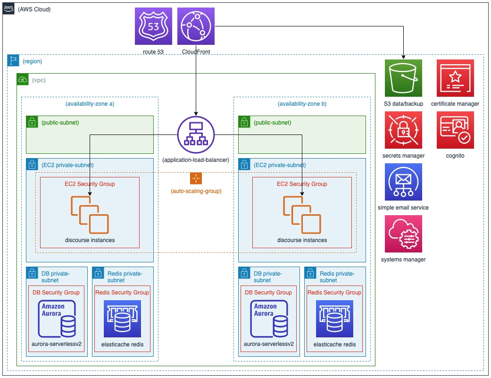

# AWS CDK For Discourse

This sample demonstrates how to create a full environment for the open source forum tool [Discourse](https://github.com/discourse/discourse). This example will
create all assets required to utilize AWS services. The discourse site will be automatically setup with an initial admin
user. An OpenID plugin is set up to allow users to login via [Amazon Cognito](https://aws.amazon.com/cognito/).

## Architecture


1. [Amazon CloudFront](https://aws.amazon.com/cloudfront/) is used for CDN via S3 and front for the application load balancer
2. [Amazon Route 53](https://aws.amazon.com/route53/) holds the hosted zone for DNS management to help create verified outbound email domains along with domain certificates
3. [Amazon S3](https://aws.amazon.com/route53/) holds user upload files and static assets in one bucket along with Discourse backups in another bucket
4. [AWS Certificate Manager](https://aws.amazon.com/certificate-manager/) is used to create a DNS validated certificate
5. [AWS Secrets Manager](https://aws.amazon.com/secrets-manager/) holds the initial setup credentials and created database credentials
6. [Amazon Cogntio](https://aws.amazon.com/cognito/) user pools are used via OpenID
7. [Amazon SES](https://aws.amazon.com/ses/) will handle outbound email notifications
8. [AWS Systems Manager](https://aws.amazon.com/systems-manager/) Session Manager is used to connect to internal instances
9. [AWS Auto Scaling](https://aws.amazon.com/autoscaling/) will create the desired number of instances in the desired availability zones
10. [Amazon EC2](https://aws.amazon.com/pm/ec2/) instances are bootstrapped via a user data script which pulls down the latest stable version of Discourse and sets up the app.yml then launches the [Discourse docker image](https://hub.docker.com/r/bitnami/discourse)
11. [Amazon RDS](https://aws.amazon.com/rds/) Aurora serverless V2 Postgres database stores user details and posts
12. [Amazon ElastiCache for Redis](https://aws.amazon.com/elasticache/redis/) is used as a caching layer

## Requirements
1. Apache Maven 3.8.5 or greater installed
2. Java 11 or greater installed
3. <a href="https://aws.amazon.com/cdk/">AWS Cloud Development Kit</a> (CDK) 1.120.0 or higher
4. Valid docker login credentials
5. A domain name hosted by Route53 which is used to
    1. Create a subdomain for discourse
    2. Validate SES domain
    3. Validate DNS Certificates
6. [Public Acl creation](https://docs.aws.amazon.com/AmazonS3/latest/userguide/access-control-block-public-access.html) must be enabled on the account for discourse to work. The following aws cli command will enable the required options
```commandline
aws s3control put-public-access-block \
--account-id 123456789012 \
--public-access-block-configuration '{"BlockPublicAcls": false, "IgnorePublicAcls": true, "BlockPublicPolicy": true, "RestrictPublicBuckets": true}'
```

## Setup
1. Git clone this repository
2. Create an AWS Secrets Manager [secret](https://docs.aws.amazon.com/secretsmanager/latest/userguide/create_secret.html) with the following key values
    1. DOCKER_USER - A docker login user (required for docker pull quota)
    2. DOCKER_PASSWORD - A docker login password
    3. DISCOURSE_ADMIN_EMAIL - The email address for the initial admin user
    4. DISCOURSE_ADMIN_PASSWORD - The password for the initial admin user
    5. DISCOURSE_ADMIN_USERNAME - The username for the initial discourse user
        1. Note this is a discourse login and not linked to cognito. This is required when setting up discourse
    6. Copy the setenv-template to setevn-{name} and edit the setenv-{name} file with information required
        1. CDK_DEPLOY_DISCOURSE_ACCOUNT - The AWS account used for this deployment
        2. CDK_DEPLOY_DISCOURSE_REGION - The AWS region used for this deployment
        3. CDK_DEPLOY_DISCOURSE_STACK_ID - The stack id can be modified to allow for CI/CD and multiple different deployments
        4. CDK_DEPLOY_DISCOURSE_HOSTED_ZONE_ID - The Route 53 hosted zone id
        5. CDK_DEPLOY_DISCOURSE_HOSTED_ZONE_NAME - The Route 53 hosted zone name
        6. CDK_DEPLOY_DISCOURSE_DOMAIN_NAME - The domain name to use for this instance of discourse for example 'discourse.example.com'
        7. CDK_DEPLOY_DISCOURSE_SES_SMTP_DOMAIN_NAME - The domain name to use for SES SMTP emails
        8. CDK_DEPLOY_DISCOURSE_NOTIFICATION_EMAIL - The email address for outbound notification emails from the Discourse system
        9. CDK_DEPLOY_DISCOURSE_DEVELOPER_EMAILS - details
        10. CDK_DEPLOY_DISCOURSE_COGNITO_AUTH_SUB_DOMAIN_NAME - details
        11. CDK_DEPLOY_DISCOURSE_SETTINGS_SECRET_ARN - 'arn:aws:secretsmanager:{region}:{account}:secret:{secret}
        12. CDK_DEPLOY_DISCOURSE_CIDR - The CIDR block to use when creating the VPC
        13. CDK_DEPLOY_DISCOURSE_CLOUDFRONT_ALB_HEADER_CHECK_HEADER - This header name is used to [restrict access](https://docs.aws.amazon.com/AmazonCloudFront/latest/DeveloperGuide/restrict-access-to-load-balancer.html) to the ALB from just CloudFront. If this environment variable is not found a default value of 'X-Discourse-ALB-Check' is used.
        14. CDK_DEPLOY_DISCOURSE_CLOUDFRONT_ALB_HEADER_CHECK_VALUE - The header value use to restrict access to the ALB from just CloudFront. If this environment variable is not found a default value of 'c9fd4d17-24a6-463f-b470-1c4347253245' is used.
    7. Before performing any cdk action run the environment setup
        1. `. setenv-{name}` to set all require environment variables
    8. Run `cd deploy` to deploy into your account
    9. It takes approx. 15-20 minutes AFTER the discourse EC2 instance is created for the full discourse setup to complete and be available
        1. The EC2 instance will set up the database structure and push assets to the S3 bucket prior to starting up the Discourse server

## Notes
1. You can log into EC2 instance via Session Manager
2. Once logged in you require `sudo -s` for most commands
3. Discourse is installed in the folder `/var/discourse`
4. Running `. discourse-env` in the `/var/discourse` folder will setup the current shell session environment variables
5. To check if the docker is running execute the command `docker ps`
6. EC2 instance startup logs are located at `/var/log/cloud-init-output.log` and can be helpful to determine the actions taken by the user data startup script. 
   1. This log may also contain any errors that occurred on startup.
7. You can run various docker commands via the Discourse helper script `./launcher {command} app`
    1. For instance `./launcher enter app` will put your into the docker instance shell
    2. `./launcher logs app` will display the logs
8. Your accounts SES (simple email service) will only send email to verified addresses unless validated for production.
   1. Via the console you can add your own email to the verified list.
   
## Resource Cleanup
### CloudFormation
1. From the <b>cdk</b> folder run <b>cdk destroy</b>

## Security

See [CONTRIBUTING](CONTRIBUTING.md#security-issue-notifications) for more information.

## License

This library is licensed under the MIT-0 License. See the LICENSE file.

